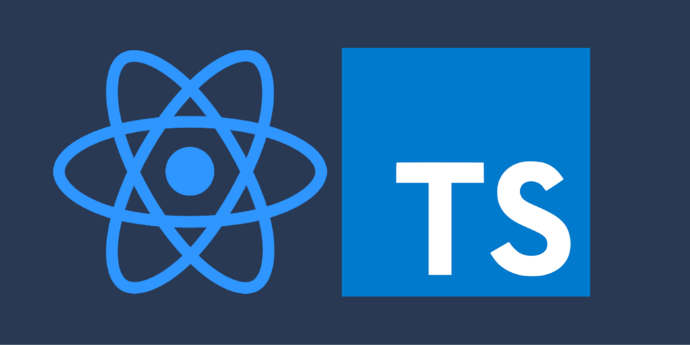

# Webpack 5 Max (JS/React/TS)

[](https://opensource.org/licenses/MIT)



### :zap: `Webpack 5 Boilerplate for JS/React/TS apps.`

:link: [Demo on CodeSandbox](https://codesandbox.io/s/webpack5-max-jsreactts-j2o2u)

---

## Includes

- 5 config files with all possible settings
  - common
  - common + development
  - common + production
  - common + production + pwa
  - common + production + analyze
- React Todo App example
  - actions: add, complete, remove, edit, update
  - filters: all, active, completed
  - controls: mark all todos as completed, clear all completed todos
  - state management: useContext/useReducer
  - styling - react-bootstrap
  - type checking - prop-types
- HTML template with all meta & link tags for SEO
  - don't forget to change values in HtmlWebpackPlugin templateParameters object
- browserconfig.xml, robots.txt, sitemap.xml
- service-worker & manifest.json
  - don't forget to change values in manifest.json
- netlify.toml with all security headers
---
You can easily add settings for Vue or Angular components.

*Vue*

- install deps

```bash
yarn add -D vue-loader vue-template-compiler
# or
npm i -D yarn vue-loader vue-template-compiler
```

- add following to config/webpack/common.js

```js
const VueLoaderPlugin = require('vue-loader/lib/plugin')

module.exports = {
  module: {
    rules: [
      {
        test: /\.vue$/,
        loader: 'vue-loader'
      }
    ]
  },
  plugins: [
    new VueLoaderPlugin()
  ]
}
```

*Angular*

- install dep

```bash
yarn add -D angular2-template-loader
# or
npm i -D angular2-template-loader
```

- change following in config/webpack/common.js

```js
{
  test: /.tsx?$/i,
  exclude: /node_modules/,
  use: [babelLoader, 'ts-loader', 'angular2-template-loader?keepUrl=true']
},
```

---

## Installation

```bash
# clone repo
git clone https://github.com/harryheman/Webpack5-Max.git

# install deps
yarn
# or
npm i
```

---

## Usage

### Development Server

```bash
yarn start
# or
npm start
```

### Production Bundle

```bash
yarn build
# or
npm run build
```

### Production Bundle PWA

```bash
yarn pwa
# or
npm run pwa
```

### Production Bundle Analyzer

```bash
yarn analyze
# or
npm run analyze
```
---
## Author

[Igor Agapov](https://github.com/harryheman)

---
## License

This project is open source and available under the [MIT License](LICENSE)
